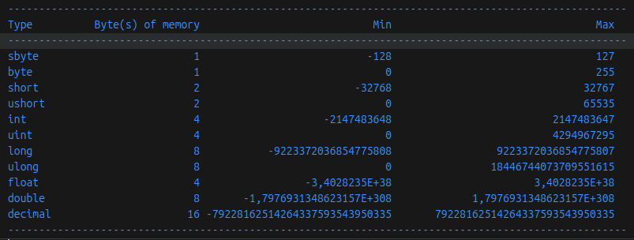

```markdown
# Практическое задание — числовые размеры и диапазоны 📊

## Задание
Консольное приложение, выводящее количество байтов в памяти для каждого из следующих числовых типов, 
а также минимальное и максимальное допустимые значения: 
sbyte, byte, short, ushort, int, uint, long, ulong, float, double и decimal.



